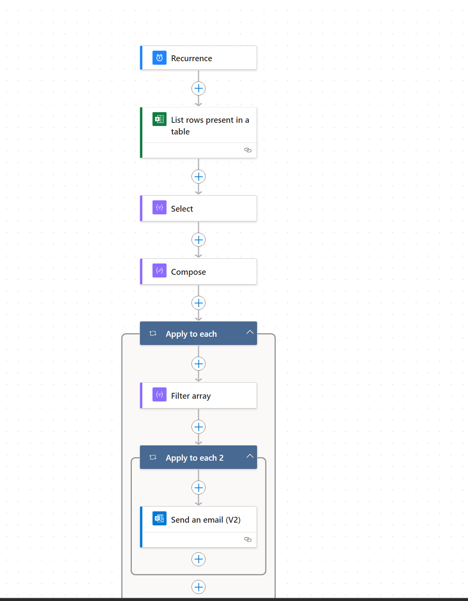
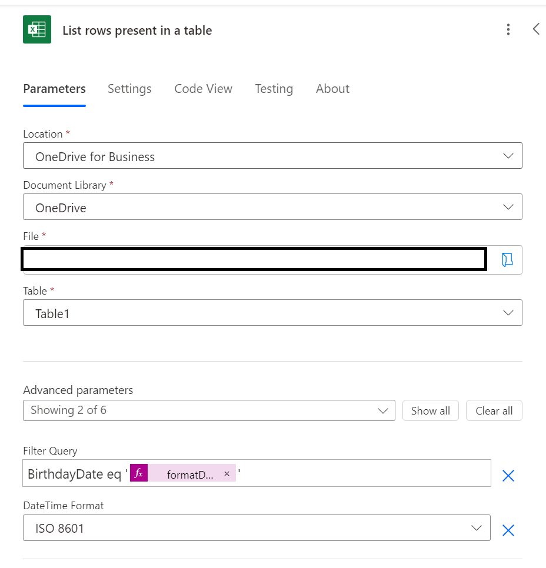
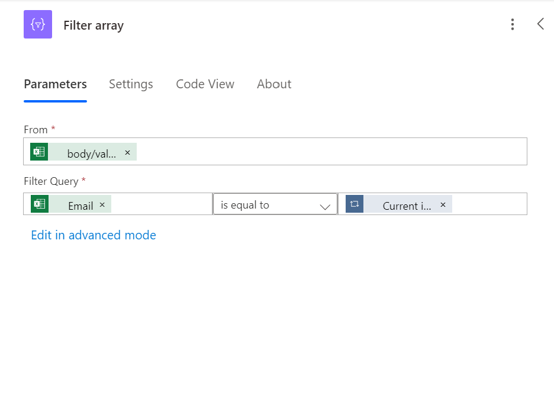
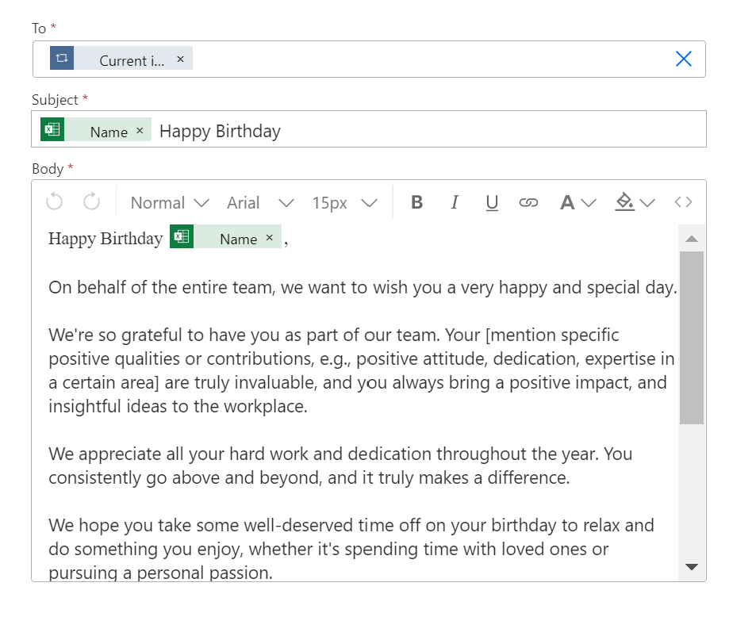

# Reminder-Flows
Project Overview
XYZ Limited, is a consulting firm that requires it's employees to get reminders on setting schedules, based on a reminder date column in a specific spreadsheet, A simple application of the reminder process, is the need for the HR team to send out regular birthday mails to the employees based on their scheduled birthday.
## Client Current State
A user has to be continously checking those date on the spreadsheet, and create an email which would be sent to a particular employee on that spreadsheet. They have heard of the capability of Powerautomate to aid in automating reminder flows, and thus have purchased an office 365 E3 License to explore it's full capabilities. You are to recommend a solution which would significantly reduce the time required to build out the desired flow.
## Solution Recommendation
With the aid of the powerplatform, we would build out a scheduled cloud flow, the flow would adequately check the reminder date column in the already designed spreadsheet, to determine when the necessary mail would be sent. 
Tools Used for the flow
1. Excel-One Drive for Business
2. Powerautomate scheduled cloud flow

## Solution Build
Kindly find below the detailed flow Chart.

1. Trigger- Recurrence (Set to trigger everyday)
2. List rows present in table action (This allows the user to extract the dynamic contents from the excel workbook), Under the Filter Query section Column_name eq'@{formatDateTime(convertFromUtc(utcNow(),'W. Central Africa Standard Time'),'yyyy-MM-dd')}' The expression returns the current date, so it checks if the reminderdate column is equal to the current Year.

3. Select Action (Selects the body value and maps it to the email column)

4. Compose (This is a union of the output of the select action)

5. Apply to each action (Filter array- From the body/Value dynamic content, and checks if the email is equal to the current item of the apply to each. Then you have a send an email action, which is addressed to the current item, and the necessary content of the mail can be filled out by the user.

